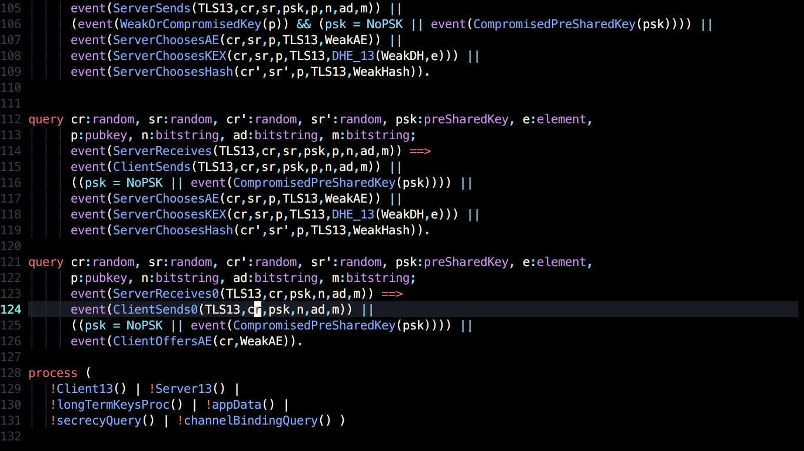
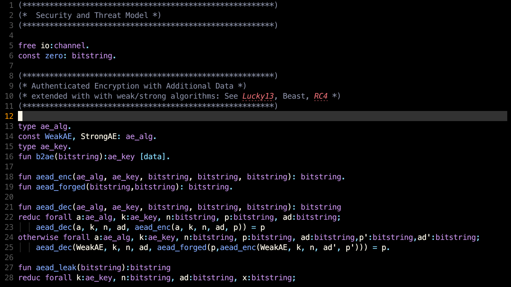
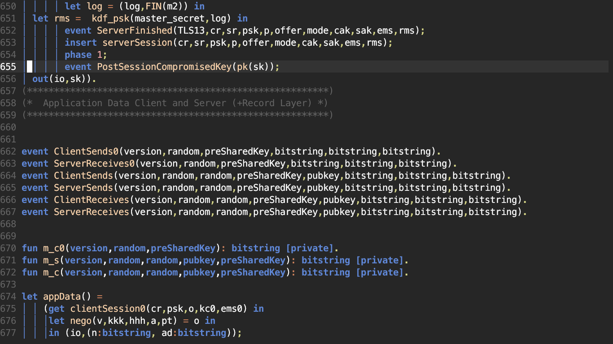
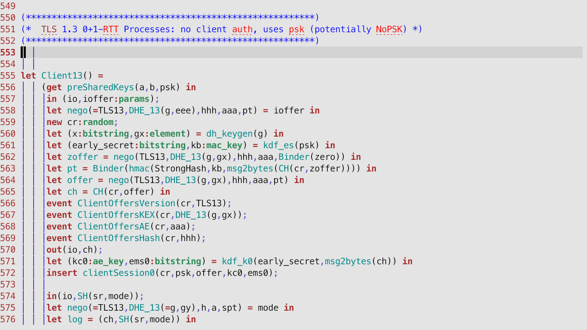

# Proverif for vim

Basic [proverif](https://prosecco.gforge.inria.fr/personal/bblanche/proverif/) support for VIM files.



## Installation

Install via your favorite package manager:

```vim
" If you are using Vim-Plug
Plug 'koraa/proverif.vim'
```

```lua
-- If you are using Packer
use 'koraa/proverif.vim'
```

## Alternatives

[smelc/proverif.vim](https://github.com/smelc/proverif.vim) served as the inspiration for this plugin. Compared to smelc's variant, this plugin:

- supports nested comments
- has theming support (through the standard highlight groups such as `Comment`, `Boolean`, etc.)
- supports a much wider set of syntax elements
- allows for installation through a package manager
- distinguishes between normal model operators/keywords (`Keyword` and `Operator` highlight groups) and query operators and keywords (`Special` highlight group)

[VincentCheval/language-proverif](https://github.com/VincentCheval/language-proverif) – I would like to test this; it works through treesitter and I have treesitter installed, but I have no idea how to install this.


## Help wanted

**Thank you:** [smelc](https://github.com/smelc) (for providing inspiration for this plugin)

This plugin is very basic at the moment and I don't really know much about writing vim syntax files; if you have any improvements, please open a pull request!

# More screenshots





# License

Copyright 2022 Karolin Varner

Licensed under the Apache License, Version 2.0 (the "License");
you may not use this file except in compliance with the License.
You may obtain a copy of the License at

   http://www.apache.org/licenses/LICENSE-2.0

Unless required by applicable law or agreed to in writing, software
distributed under the License is distributed on an "AS IS" BASIS,
WITHOUT WARRANTIES OR CONDITIONS OF ANY KIND, either express or implied.
See the License for the specific language governing permissions and
limitations under the License.
